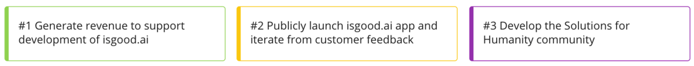

# Goals & Product Build

We are a community of purpose-driven super-heros, focussed on solving wicked systemic humanitarian and social problems at global scale.  Using evolutionary frontier technology, we are creating the levers to help make this happen.

Isgood.ai si the first product from Solutions for Humanity, and is being developed first; as we need to know what actually works, so we can dedicate resources and efforts towards the initiatives and areas of work that are going to have the greatest positive impact, end-beneficiary outcomes and change.


**Once we have insights from isgood.ai    
-&gt;  then we start work on other solutions, knowing what is good.**


The record of our 2021 Community All-Hands kickoff is in our [Loomio](https://www.loomio.org/d/1c0GpyAr/20210202-feb-isgood-ai-all-hands).

## 2021 Goals

## 2021 Q1 & Q2 Objectives 📌

1. **Q1** -&gt; Have deployed and usable the "Module One" Indicator recommendation **WebApp** and supporting underlying platform and API functionality.
2. **Q2** -&gt; Have deployed and usable the Core Functionality of the **WebApp** and supporting underlying platform and API functionality.


**PLEASE NOTE**:  The way isgood.ai has been designed, built and released follows a mashup of [Open](https://en.wikipedia.org/wiki/Open-design_movement) [Modular](https://en.wikipedia.org/wiki/Modularity) [Integrated](https://en.wikipedia.org/wiki/System_integration) [Systems Design](https://en.wikipedia.org/wiki/Systems_design) principles, enabling best purpose for global good.    
_**Every release will extend further beyond current available understandings and insights.**_


## Release Targets

* 2021-Q1:  Beta-Release, indicators and evidence \(data\) to solve problems \(SGD, GRI, IRIS, etc\).
* 2021-Q2:  General Availability of isgood.ai WebApp, Dashboards, Data-Connectors, AI-Assistant.
* 2021-Q3:  Consolidate from Q1 & Q2, based on user feedback, extend data-connecters & scripts.
* 2021-Q4:  Prioritise features and enhancements from platform design, extend AI-assistant.
* 2022:  All currently scoped features will be released, along with platform-API, field-apps, predictive and prescriptive modelling, as well as cross-organisation collaboration & resource matching.

